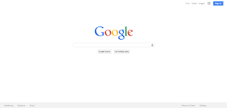

# website1
First website, HTML &amp; CSS
<!doctype html>
<!-- Above is not a valid doctype -->

<html>

<head>
  
  

<title id="second"> Kirkpatrick Media </title>
<h2> <a name="Top Of Page"> Welcome to Kirkpatrick Media!:</a></h2>

<!-- Sliding side menu -->

<a href="#Free Resources">| Free Resources |</a>
<a href="#TikTok Videos">| TikTok Videos |</a> 
<a href="#Podcasts">| Podcasts |</a> 
<a href="#Articles">| Articles |</a> 
<a href="#Number Stuff">| Number Stuff |</a> 
<a href="#Data Stuff">| Data Stuff |</a> 
<a href="#About us">| About us |</a> 

 

</head>

<body>  
Quick Links:
<!-- making an atribute link, with Tool Tip -->
<a href="https://www.twiter.com/ShaneKirkpatrick19?s=03" title="Twitter">Link</a>  
  <a href="https://www.instagram.com/shaneckirkpatrick" title="Instagram">Link</a>  
  <a href="https://www.facebook.com/shane.kirk.142" title="Facebook">Link</a>  
  <a href="https://www.youtube.com/channel/UCPzh9wYRqd86EID5KFTnScw?view_as=subscriber" title="YouTube">Link</a>  
  <a href="https://www.google.com" title="Tool Tip">Link</a>  

<!-- Slidding logo -->
  

<!-- Profile Picture -->
<a> img src="googlewebsite.png"/> </a>  
<h2> Shane Kirkpatrick, </h2>
<strong><h3> Pasion, Community, Growth </h3></strong>
<em><h3> He/Him/His </h3></em>  

<h2>  Data Stuff </h2>  

<!-- width="% of page or number of pixels"-->
<!-- cellspacing="space between cells" cellpadding="Spacing inside cells around cell content"-->
<table border="2">
	<tr>	<th colspan="3"><h3> Full Title</h3></th>	</tr>
	<tr>	<th> Header 1</th><th> Header 2</th><th> Header 3</th>	</tr>
	<tr>	<td> Item 1</td><td> Item 2</td><td> Item 3</td>	</tr>
	<tr> 	<td> Item 4</td><td> Item 5</td><td> Item 6</td>	</tr>
</table> 

Heres another
<table border="1">
	<tr>	<th colspan="3"><h3> Full Title</h3>	</th>
	<tr>	<th> Header</th><th> Longer Header</th>	</tr> 
	<tr>	<td > Item 1</td><td> Item 2 is a longer one taking up some space</td>	</tr>
</table> 

<h2>Photo Table</h2>
<table border="2" width="50%" cellspacing="10">
	<tr> 
		<td>   </td>
		<td>   </td>
		<td>   </td>
	</tr>

	<tr> 		
		<td>   </td>
		<td>   </td>
		<td>   </td>
	</tr>
</table>  

<h2>  Cool List </h2>  
<h2> Unordered list </h2>
<ul> <!-- bullet points-->
<li>This is a thing on a list</li>
<li>This is a new thing on a list</li>
<li>This is a thing on a list</li>
</ul>
<h2> Ordered list </h2>
<ol><!-- numbered points-->
<li>This is a thing on a list</li>
<li>This is a new thing on a list</li>
<li>This is a thing on a list</li>
</ol>  

<h3> <a name="Free Resources">Free Resources</a> </h3>

 The term of office of all Board members shall begin on July 1 following the date of their election. Board members shall serve until their successors are elected and qualified. Board members must qualify by taking the oath of office before assuming the duties of office. (ORS 341.326 [4])  

<h3>  TikTok Videos </h3>

 Welcome to my TikTok videos. Grab some popcorn and get comfy because you won't wanna miss a second!  
  Top 50 videos:    Adventures of Eg:         Breakfast Corner:         Shane's top 15:  

<h3> Podcasts</h3>

 When a vacancy occurs on the Board the remaining members shall fill it by appointing a qualified resident of the zone in which the vacancy exists. The member so appointed shall serve until the next regular district election when a successor shall be elected to serve for the remainder of the unexpired term. 
A Board member who changes residence from one zone to another zone, or who no longer resides in the zone due to a change in zone boundaries, is entitled to remain as a Board member until June 30 following the next regular board election date at which a successor shall be elected. (ORS 341.335 (2)) 

<h3>  Articles </h3>

 The Board of Directors of the Portland Community College district shall elect one of its members as Chairperson and another as Vice Chairperson at its annual organizational meeting in July. The President of Portland Community College shall serve ex-officio as Executive Officer of the Board. The President may appoint a deputy to assist in that role.  

<h3> About us </h3>

 Kirkpatrick Media was created in 2020 by Shane Kirkpatrick as a place where he could post photos, vidoes, articles, other social media content and free resources. This was created out of frustration and excitement. These thoughts were born out of the idea that there is a ton of free content, entertainment, and production applications. Everything here is made as an example of what you can do if you are interested. Please email Shane with any thoughts, comments, or criticisms: shaneckirkpatrick@gmail.com
  

<!-- This needs to be improved-->
<a href="mailto:example@gmail.com"> *Email Me </a>

 *Only works for your computer default emailing system
  

<a href="#Top Of Page">| Top Of Page |</a>
</body>

</html>

